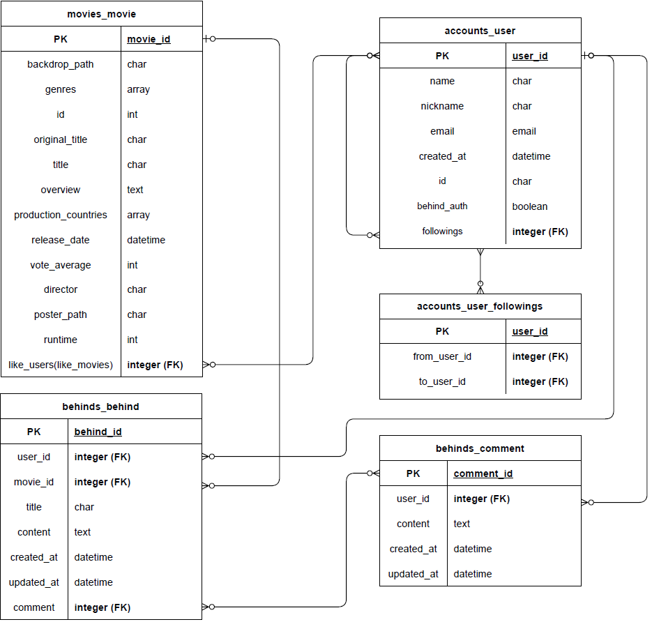

# 명세

## 1. 개요

- 프로젝트명 : Dojiny
- 개발인원 : 2명
- 개발 기간 : 2022.11.14 ~ 2022.11.24
- 주요 기능
  - 감독 hebind - CRUD 기능 , 구독, 좋아요
  - 영화 검색 - 장르/키워드 검색
  - 영화 추천
  - 사용자 - 팔로우, 회원가입 및 로그인, 회원 정보 수정, 유효성 검사 및 중복 검사
- 개발 언어 : Python JavaScript
- 개발 환경 : VSCode Django Node.js
- 데이터 베이스 : Django
- 형상 관리 툴 : GitHub
- ERD 툴 : draw.io
- 와이어 프레임 툴 : Figma

## 2. 페이지 기능 별 요구사항

#### 1. 회원가입 및 로그인 페이지

- 유효성 검사
  - 각 형식에 맞는 패턴 확인

- 중복확인 
  - 닉네임 / 이메일 / 유저아이디 중복검사

- 로그인이 필요한 페이지
  - 전체 페이지

- 로그인 검사
  - 아이디와 비밀번호가 일치하지 않으면 "이이디 또는 비밀번호가 일치하지 않습니다." 띄우기
  - 이외의 에러 처리
  - behind 작성을 위한 인증 관련 문구를 띄워줌
    - 주어진 email로 해당 정보/파일을 받음
  - 로그인 이후 메인 페이지 이동

#### 2. 영화 검색

- 장르와 년도를 선택하는 것으로 영화 분류하여 선택 가능
- 정렬 기능
- 영화 디테일 정보 확인 가능

#### 3. Behind 페이지

- Behind
  - CRUD
  - behind 작성 권한이 있는 user만 작성 가능
  - 내용 수정을 해당 작성자만 가능
  - 해당 작성자를 팔로우 하는 기능
- Behind 댓글
  - CRUD
  - 모든 유저가 작성 가능
  - 내용이 비어있으면 작성 불가
  - 내용 수정을 해당 작성자만 가능
  - behind글 삭제 시 해당 댓글들도 삭제됨

#### 4. 영화 추천 페이지

- 내가 평가한(별점 매긴) 영화를 바탕으로 영화 추천
- 영화 평가를 하지 않았다면 평점 높은 영화 추천
- 누르면 디테일 페이지로 이동

#### 5. 마이 페이지

- 내 페이지면 RUD 가능
- '좋아요'한 영화 목록 표시 기능
- 팔로우한 감독 목록 표시 기능
- 다른 사람의 영화 목록 / 감독 목록 확인 가능

## 3. API 구성

| 기능                 | method   | url                                                          | return page                                         |
| :------------------- | -------- | ------------------------------------------------------------ | --------------------------------------------------- |
| _**로그인 기능**_    | -        | -                                                            | -                                                   |
| 로그인 화면          | get/post | /accounts/login/                                             | 로그인  / 메인 페이지                               |
| 로그아웃             | get      | /accounts/logout/                                            | 초기 화면                                           |
| 회원 가입            | get/post | /accounts/signup/                                            | (성공시) 메인 페이지, (실패시) 회원 가입 페이지     |
| 비밀번호 수정        | post     | /accounts/password/                                          | (성공시) 메인 페이지, (실패시) 비밀번호 수정 페이지 |
| 회원 정보 페이지     | get      | /accounts/<int:user_pk >/profile/                            | 회원 정보 프로필                                    |
| 회원 정보 수정       | post     | /accounts/<int:user_pk >/update/                             | (성공시) 메인 페이지, (실패시) 정보 수정 페이지     |
| 회원 정보 삭제       | post     | /accounts/<int:user_pk >/delete/                             | 초기 화면                                           |
| 팔로우               | get      | /accounts/<int:user_pk >/follow/                             | behind 페이지                                       |
| _**감독 behind**_    | -        | -                                                            | -                                                   |
| behind 화면          | get      | /behinds/                                                    | behind 페이지                                       |
| behind 작성          | post     | /behinds/create/                                             | behind 페이지                                       |
| behind 디테일        | get      | /behinds/<int:behinds_pk >/detail/                           | behind 디테일 페이지                                |
| behind 삭제          | post     | /behinds/<int:behinds_pk >/delete/                           | (성공 후) behind 페이지                             |
| behind 수정          | post     | /behinds/<int:behinds_pk >/update/                           | (성공 후) 디테일 페이지                             |
| comment 작성         | post     | /behinds/<int:behinds_pk >/comment_create/                   | (성공 후) 디테일 페이지                             |
| comment 수정         | post     | /behinds/<int:behinds_pk >/comment_update/<int:comment_pk >/ | (성공 후) 디테일 페이지                             |
| comment 삭제         | post     | /behinds/<int:behinds_pk >/comment_delete/<int:comment_pk >/ | (성공 후) 디테일 페이지                             |
| behind likes         | get      | /behinds/<int:behinds_pk >/likes/                            | (토글) behind 페이지                                |
| _**영화 추천**_      | -        | -                                                            | -                                                   |
| 추천 페이지          | get      | /recommendations/                                            | 추천 페이지                                         |
| _**영화 검색**_      | -        | -                                                            | -                                                   |
| 검색 메인 페이지     | get      | /movies/                                                     | 검색 메인 페이지                                    |
| 영화 디테일          | get      | /movies/<int:movie_pk >/detail/                              | 영화 디테일 페이지                                  |
| _**마이 페이지**_    | -        | -                                                            | -                                                   |
| 팔로우 감독 페이지   | get      | /mypage/<int:user_pk >/directors/                            | 팔로우한 감독 페이지                                |
| 좋아요한 영화 페이지 | get      | /mypage/<int:user_pk >/likemovies/                           | 좋아요한 영화 페이지                                |

## 4. ERD 구조

## 5 . 와이어 프레임

Figma

------

- requirements
  - 영화 데이터 API에서 불러오고 저장할 방법
    - 페이지를 요청할 때마다 API 요청으로 데이터 저장
  - 영화 추천
    - 추천 로직
    - user가 영화를 평가하지 않았다면 상위 평점 영화 출력
  - 유저 profile
    - 본인만 본인의 profile 접근 가능 (비밀번호 변경, 회원정보 수정, 회원 탈퇴)
    - 타 user의 profile에 접근 시 그 user의 영화 목록과 감독 목록을 볼 수 있음
